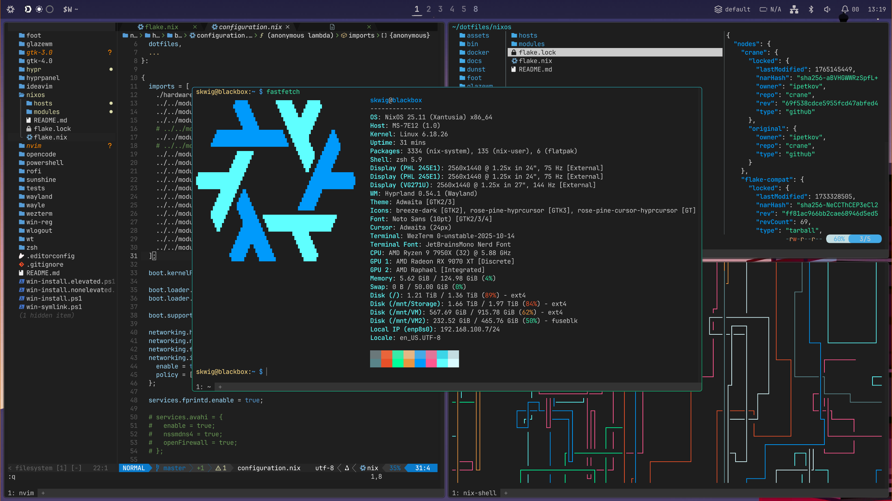

# dotfiles

My collection of dotfiles and configs for everyday dev, homelab and gaming

## NixOS



### Installing
```sh
sudo nixos-rebuild switch --flake ~/dotfiles/nixos#blackbox
```

### Credits & Inspirations
- [vasujain275](https://github.com/vasujain275/rudra)
- [Cybersnake223](https://github.com/Cybersnake223/Hypr)
- [SeniorMatt](https://github.com/SeniorMatt/Mattthew-s-Dotfiles)

### Mood board
- https://github.com/jtrull/dotfiles
- https://github.com/pgagnidze/dotfiles/commit/5f62664146338d06a9228ebc0795de21cadf0ad7
- https://www.reddit.com/r/unixporn/comments/1umjovz/hyprland_first_rice_quickshell/
- https://github.com/bdebiase/nixos-config
- https://github.com/Nautilus4K/Hyprland-Configs
- https://github.com/weldros/dotfiles
- https://github.com/octagonemusic/octashell - dobry clipboard / img preview

## Windows

### Installing
```ps1
# Elevated shell
.\win-capabilities.ps1
# Non-elevated shell
.\win-install.ps1
# Elevated shell
.\win-symlink.ps1
```
