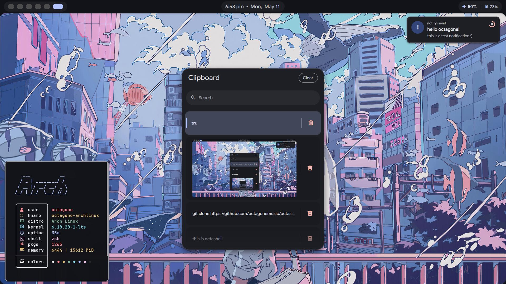
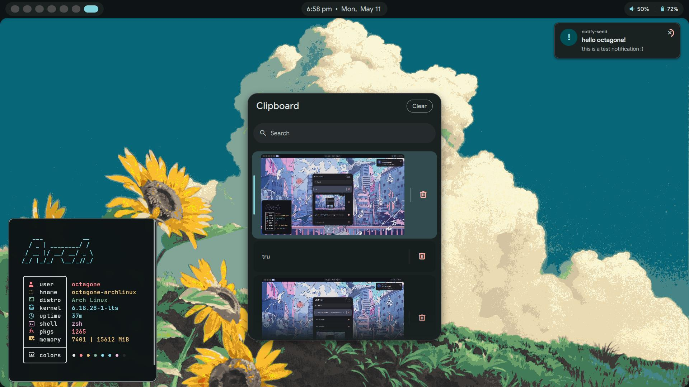

# octashell

| | |
| :---: | :---: |
|  |  |

hii everyone this is my quickshell config :)

im trying to still learn QML and quickshell and how everything else works and update it as i go in this project. im trying to follow a simple and yet understandable structure in the hopes that people will be able to follow this in the future to be able to make their own shell using quickshell by using mine as an inspiration and a tutorial :)

### my design philosophy

my theming and stuff is based on **material m3 expressive**. you can find more about the design philosophy [here](https://m3.material.io/) 

---

###  how to run this

to run this config, just install quickshell on your distro and clone this repo into your config directory:

```bash
git clone https://github.com/octagonemusic/octashell.git ~/.config/quickshell
```

---

### my goals for this project

the reason i made this was because i found existing shells such as caelestia and other shells very hard to follow, but somehow after stumbling my way through QML and quickshell for months i have a basic understanding of QML and its components :)


pls feel free to reach out to me if you want to clear anything up or just wanna chat about this stuff cause it would help me learn about this too :)

happy ricing !! 

---

p.s. once i have a fully setup shell i will update my full shell complete with the matugen templates and other apps that i configured (and maybe an install script to just do it for you directly) :)
